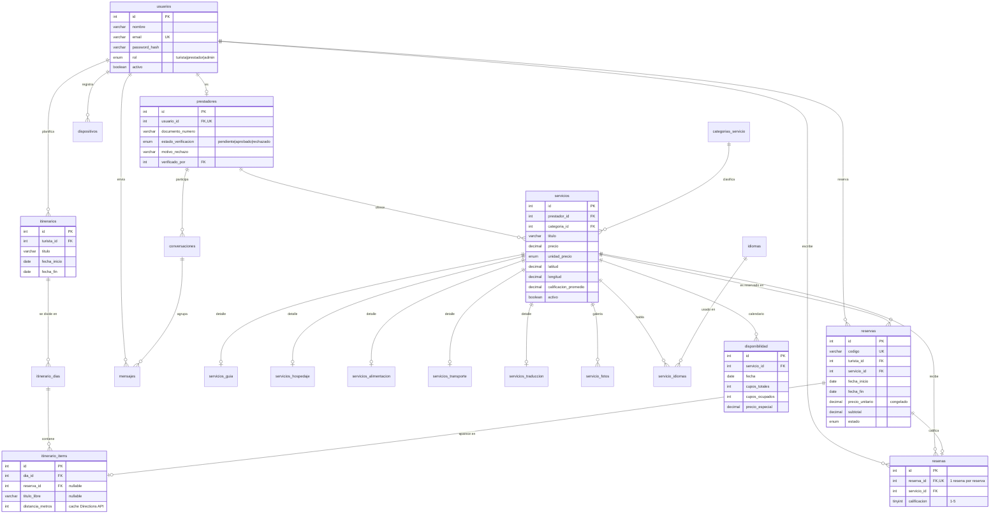

# Modelo de datos — TravelHub

Documento técnico del modelo entidad-relación. Corresponde 1 a 1 con
`backend/src/db/schema.sql`.

**Motor:** MySQL 8 / InnoDB · **Charset:** `utf8mb4_unicode_ci`
**Tablas:** 21 · **Vistas:** 2 · **Claves foráneas:** 27 · **Restricciones CHECK:** 16 · **Triggers:** 4

---

## 1. Decisiones de diseño

### 1.1. Herencia de servicios (Class Table Inheritance)

Los cinco tipos de servicio comparten atributos (precio, ubicación, prestador,
calificación) pero cada uno tiene los suyos. En vez de repetir columnas o
meter un `JSON` sin estructura, se usa una tabla base más tablas satélite:

```
servicios (común)
  ├── servicios_guia          1:1
  ├── servicios_hospedaje     1:1
  ├── servicios_alimentacion  1:1
  ├── servicios_transporte    1:1
  └── servicios_traduccion    1:1
```

En cada satélite la **PK es también FK** hacia `servicios.id`, lo que garantiza
la relación 1:1 a nivel de motor, no por convención.

*Por qué:* el catálogo se consulta con filtros unificados sobre una sola tabla
(`WHERE activo AND categoria_id = ? AND ciudad = ?`), y agregar un tipo nuevo
es crear una tabla satélite sin tocar nada de lo existente. Cumple el
requisito no funcional de escalabilidad del enunciado.

### 1.2. Congelado de precio en las reservas

`reservas` guarda `precio_unitario`, `cantidad` y `subtotal` en lugar de
calcularlos desde `servicios.precio`. Si el prestador sube su tarifa mañana,
las reservas ya hechas conservan lo pactado. Es la diferencia entre un dato
transaccional y uno de catálogo.

### 1.3. Calificación promedio cacheada

`servicios.calificacion_promedio` y `total_resenas` están desnormalizados a
propósito: listar el catálogo no debe hacer un `AVG()` sobre toda la tabla de
reseñas. La consistencia la garantizan dos **triggers** (`trg_resena_insert`,
`trg_resena_delete`), no el código de Node — así el dato no puede quedar
desincronizado si alguien inserta por otra vía.

### 1.4. Verificación de prestadores con tres estados

`prestadores.estado_verificacion` es un `ENUM('pendiente','aprobado','rechazado')`,
no un booleano. Con un booleano, "nunca revisado" y "revisado y rechazado"
serían ambos `false`, y el administrador no podría saber qué solicitudes le
quedan por atender. `motivo_rechazo` acompaña al estado `rechazado` y se le
muestra al prestador para que sepa qué corregir.

*(Cambio introducido por la migración `001_estado_verificacion.sql`.)*

### 1.5. Categorías como tabla, no como ENUM

`categorias_servicio` es una tabla de consulta. Agregar una categoría es un
`INSERT`, no un `ALTER TABLE` que bloquea la tabla.

### 1.6. Una regla que MySQL no deja expresar como CHECK

Una parada del itinerario debe ser algo: o una reserva, o un punto libre con
nombre. Lo natural sería:

```sql
CHECK (reserva_id IS NOT NULL OR titulo_libre IS NOT NULL)
```

MySQL 8 lo **rechaza** con el error 3823, porque `reserva_id` tiene una clave
foránea con `ON DELETE SET NULL`: esa acción modificaría la columna sin volver
a evaluar el `CHECK`, así que el motor prohíbe la combinación en vez de
permitir filas inválidas.

Como el `SET NULL` es justo el comportamiento deseado (la parada sobrevive a
la reserva), la regla se aplica con dos triggers `BEFORE INSERT` y
`BEFORE UPDATE` que lanzan `SIGNAL SQLSTATE '45000'`.

Queda un hueco: las acciones referenciales **no disparan triggers** en MySQL,
así que un `SET NULL` podría dejar la fila sin reserva y sin título. Se cierra
desde el controlador, que al agregar una parada desde una reserva guarda
también el título del servicio.

### 1.7. Política de borrado

| Relación | Regla | Motivo |
|---|---|---|
| `usuarios` → `prestadores` | `CASCADE` | El perfil no existe sin la cuenta |
| `servicios` → `reservas` | `RESTRICT` | No se puede borrar un servicio con historial; hay que desactivarlo (`activo = FALSE`) |
| `reservas` → `itinerario_items` | `SET NULL` | El punto sigue en el mapa aunque se cancele la reserva |
| `usuarios` → `prestadores.verificado_por` | `SET NULL` | Si se borra el admin, el prestador conserva su estado de verificación |

---

## 2. Diagrama entidad-relación



---

## 3. Módulos del enunciado y su soporte en el modelo

| Módulo | Tablas implicadas | MVP |
|---|---|---|
| 4.1 Gestión de usuarios | `usuarios`, `prestadores` | Sí |
| 4.2 Búsqueda y reserva | `servicios`, `categorias_servicio`, `disponibilidad`, `reservas`, vista `v_catalogo` | Sí |
| 4.3 Constructor de ruta | `itinerarios`, `itinerario_dias`, `itinerario_items` | Sí |
| 4.4 Calculadora de costos | vista `v_costos_itinerario` | Sí |
| 4.5 Chat y notificaciones | `conversaciones`, `mensajes`, `dispositivos` | Sí |
| 4.6 Panel del prestador | `servicios`, `disponibilidad`, `reservas` | Sí |
| 4.7 Calificaciones | `resenas` + triggers | Sí |
| Traductores / restaurantes / transporte | `servicios_traduccion`, `servicios_alimentacion`, `servicios_transporte` | Trabajo futuro (tablas ya creadas) |

---

## 4. Vistas

**`v_catalogo`** — servicios activos con su categoría, prestador y foto
principal ya resueltos. Evita repetir cuatro `JOIN` en cada endpoint del
catálogo.

**`v_costos_itinerario`** — implementa el punto 4.4: total del viaje agrupado
por categoría de servicio, contando solo reservas no canceladas. Es
literalmente el desglose que pide el enunciado (hospedaje, alimentación,
guía, transporte, traducción).

---

## 5. Índices

Además de los implícitos por PK y UNIQUE:

| Índice | Tabla | Consulta que optimiza |
|---|---|---|
| `idx_prestadores_estado (estado_verificacion)` | `prestadores` | Bandeja de solicitudes pendientes del admin |
| `idx_servicios_busqueda (activo, categoria_id, ciudad)` | `servicios` | Filtro principal del catálogo |
| `idx_servicios_precio`, `idx_servicios_calificacion` | `servicios` | Ordenar por precio o valoración |
| `uq_disponibilidad (servicio_id, fecha)` | `disponibilidad` | Consulta de calendario y `upsert` con `ON DUPLICATE KEY UPDATE` |
| `idx_reservas_turista (turista_id, estado)` | `reservas` | "Mis reservas" filtradas por estado |
| `idx_mensajes_conversacion (conversacion_id, enviado_en)` | `mensajes` | Cargar el historial del chat en orden |

---

## 6. Datos de prueba

`backend/src/db/seed.sql` carga un escenario de Puno: 8 usuarios (1 admin,
3 turistas, 4 prestadores), 6 servicios entre guías y hospedajes, calendario
de disponibilidad, 6 reservas en los cuatro estados posibles, un itinerario
completo de 3 días, dos conversaciones de chat y dos reseñas.

Incluye deliberadamente casos límite para la demo: un prestador **sin
verificar** (para mostrar el flujo de aprobación del admin), una reserva
**cancelada**, y precios especiales de temporada alta para la Candelaria.

Contraseña de todos los usuarios de prueba: `travelhub2026`.

```bash
mysql -u root -p < backend/src/db/schema.sql
mysql -u root -p < backend/src/db/seed.sql
```
